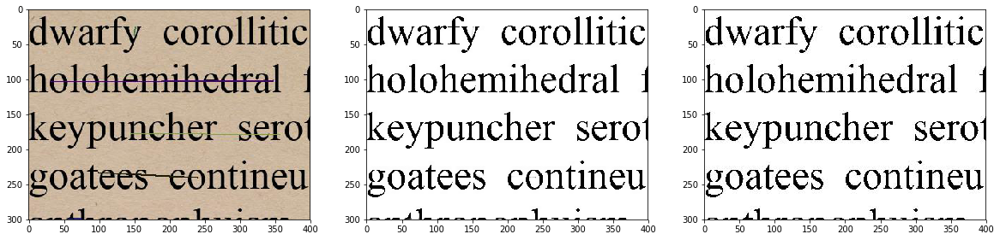

# Denoise Generated Text

Implementation of autoencoder for image denoising trained on generated text images.

### Required libraries

- PIL (pillow)
- pytorch

### How Run

Run `generate_and_train.ipynb` to generate and train the model. (tested on Google Colab)

### Results

Below is the result after training from 10k generated images.

